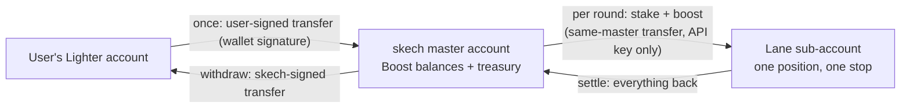
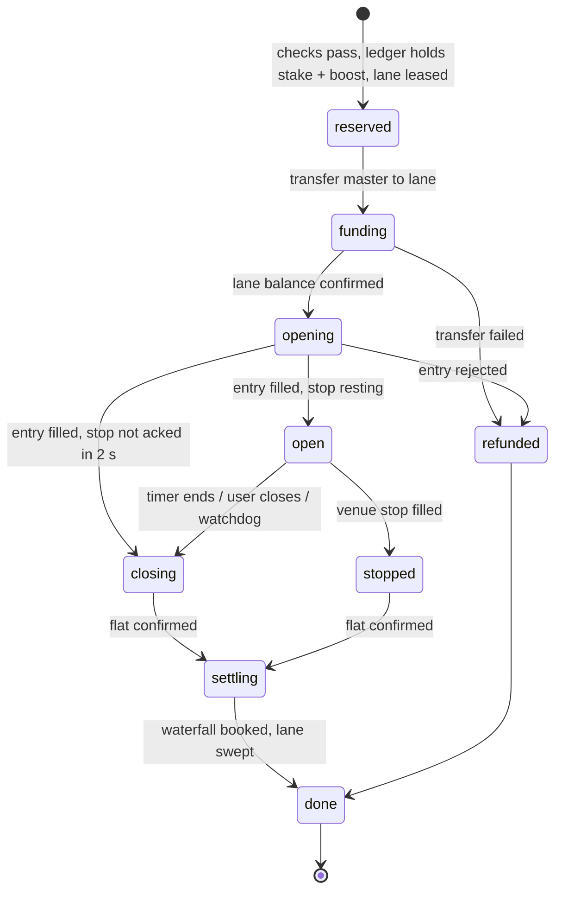

# Boost: implementation plan

Written 2026-09-23.

## Built (2026-09-23, testnet)

The plan below is implemented. It has run end to end on testnet against a real
treasury.

**Speed (testnet, measured 2026-09-23)**

| | Before | Now |
|---|---|---|
| Wild open, press to venue ack | 3.2 s | 336–364 ms |
| Normal open | — | 363–414 ms |
| Round done, after its end | 6–11 s | 0.2–0.5 s |
| Wild settled, after flat | 2.2 s | 402 ms |

- **Lane float.** Each lane holds `BOOST_LANE_FLOAT` ($200) of skech's money
  between rounds. A round trades stake plus boost out of it, so opening moves
  nothing. Settling is what the lane holds less the rest of the float. The lane
  is topped back up (`tend`) after the result is booked, and only then leased
  again.
- **Margin.** A lane holding exactly stake plus boost had an open cancelled by
  Lighter (`canceled-margin-not-allowed`). The float ends that, and the headroom
  is now 0, so Wild is a clean 300×.
- **Ending.** A round ends on its own fills netting to zero, not on the position
  push, which trailed the fill by up to a second on testnet. It ends on an
  estimate when a push carried no P&L, and books Lighter's figure after.
- **When pushes stop.** An order with no answer, or acked and unfilled, is
  checked against the venue's account over HTTP (`heldNow`) before the round is
  called flat. Whatever is held gets closed. On testnet the socket went quiet
  mid-round and a filled open was taken for a cancelled one. That left a lane
  holding a position until it was closed by hand. The watchdog for cancelled
  opens asks the venue the same way, and the desk closes a lane still holding
  a position after its round (`flatten`).

**Testnet: judged and paid at the real market's price (decided 2026-09-23)**

- Orders are real, on Lighter testnet. The chart is real, Lighter mainnet trades.
  Nothing is generated.
- Testnet's BTC price tracks mainnet within about $6–19, but its spread was
  $59–64 against mainnet's $0.10–5. At Wild's 0.036 BTC that is about $2.20 a
  turn, so a flat line hit the $8 stop in two turns.
- So on testnet each order is valued at the mainnet chart price stamped when
  Lighter took it (`chartAt`, `Rounds.chartNet`):
  - The $8 stop is the engine's, on that figure. No stop rests on Lighter,
    which would fire on testnet's own prices.
  - The user is paid on it (`settleAt`); skech keeps what the lane really holds
    less that, so skech carries testnet's spread.
  - User plus skech still equals the lane, so the books still match the venue.
- Measured: a round whose testnet fills lost $4.19 paid the user $9.41 of $10
  (chart −$0.49, fee $0.10), with drift $0.
- Mainnet is the venue's prices throughout, with the stop resting on Lighter.

**What the user sees: three paces**

- The pace button next to Size offers **Slow**, **Normal** and **Wild**, by
  name only. Advanced shows the numbers (10×, 50×, and Wild's 300×: six times
  the money at 50×) and the 1–50× wheel for the plain paces.
- While a Wild round runs, every figure is the user's share: 70% of a gain,
  a loss capped at the stake. The same figure is what settles.
- Wild is one trade to the user: their stake and skech's sit in one position
  on a lane, and the chart, battery and history show only the user's money.
- There is no Boost balance to manage. The money moves by itself:
  - **In.** While a Wild line is drawn, the shortfall moves from the user's
    Lighter account (`fundWild`), so the press is one order. The embedded wallet signs it without a
    prompt. Lighter's fee comes from the Lighter account on top.
  - **Out.** Leaving Wild sends what is left home (`returnWild`). So does the
    trader by itself once a wallet has had no round for `BOOST_RETURN_AFTER_S`
    (600 s by default). Less than Lighter's fee cannot be sent; it stays.
  - **Shown.** The balance in the top bar is Lighter equity plus whatever is on
    skech's side, so it is one figure.
- **Why not two trades,** one on the user's account and one on skech's. The
  split of a combined result needs a transfer after every round: skech pays the
  user on a win, and the user owes skech about 5/6 of the loss on a loss.
  Collecting that needs the user's wallet signature after the round, and a user
  who closes the tab walks away from it. One pooled position settles inside
  skech's own accounts, and moves money only when a top-up or a return is due.

**Run it**

- `bun run --filter @skech/trader boost:setup`
  - Creates the treasury: a wallet, a master account funded from the faucet,
    one trading key and 4 lanes.
  - Writes `BOOST_*` to `.env.local`.
  - Restart the trader after it runs; env is read only at start.
- `TRADER=http://localhost:3220 bun run --filter @skech/trader boost:e2e`
  - Uses a throwaway user.
  - Runs faucet → trading key → add $30 → one boosted round → send it all home.
  - Checks the books against the venue.

**What was measured on testnet**

| | Round ended on time | Round stopped (close line forced tight) |
|---|---|---|
| Deposit | $30 in, Lighter's fee $3 | same |
| Position | $58.20 at 50x on a lane | same |
| Stop on Lighter | resting, cancelled with the close | fired: trigger $84,638.61, filled $84,593.40 |
| Lane at the end | $58.19 | $57.45 |
| Back to the user | $8.09 (1% fee $0.10) | $7.35 (fee $0.10) |
| Books vs venue | drift $0.000000 | drift $0.000000 |

**Where the code is**

| Piece | Where |
|---|---|
| Signing transfers and sub-accounts | `services/trader/native/shim.c`, `src/signer.ts`, `src/l1.ts` |
| Stop resting on Lighter, moved with each trade | `src/rounds.ts` (`venueStop`, `arm`, `guard`), `src/executor.ts` (`Extra`) |
| Settlement maths | `src/boost/money.ts` |
| Double-entry ledger, leases, reserve cap | `src/boost/store.ts` |
| Transfers | `src/boost/treasury.ts` |
| Round lifecycle, recovery, reconciliation | `src/boost/desk.ts` |
| Routes (`/boost/*`) | `src/index.ts` |
| App | `lib/boost.ts` (`fundWild`, `returnWild`), the paces in `draw-controls.tsx`, the battery in `sketch-tray.tsx`, the combined balance in `lib/profile.ts` |

**Tests** (57 in the trader)

- **Settlement:** conserves money exactly over 20,000 random rounds.
- **Stop resting on Lighter:** placing it, firing it, a flat position arriving
  before the fill, a flip, the round ending on time, and a fill arriving before
  the position.
- **Ledger against Postgres:**
  - holds and bookings;
  - idempotent retries;
  - the cap, one round per user, and lane leasing;
  - two withdrawals racing for one balance.

**Found while building, and changed**

- **Lighter charges for transfers to another account:** $3 on testnet and $1 on
  mainnet (`transferFeeInfo`).
  - Adding money pays it on top.
  - Taking money out has it taken off what arrives.
  - Both screens say so before anything is signed.
- **The first transfer between the treasury's own accounts cost nothing** in the
  test runs. The ledger's zero drift confirms it.
- **Testnet's book is wide.** A $2,910 position loses about $1.80 to the spread,
  about 6 bp. On mainnet BTC the spread is about 0.01 bp.

**Still open before real money**

1. **Who can open a round.** The trader trusts the `address` in a request, as it
   already does for ordinary rounds.
   - Someone who knows your address could open boosted rounds with your Boost
     balance.
   - They can't take money out: withdrawals only go to the address's own Lighter
     account.
   - Needs a signed session before mainnet.
2. **Secrets.** The treasury wallet key is in `.env.local`. Move it to a secrets
   manager.
3. **The three Lighter questions in §8**, and legal advice (§9).
4. **Capacity.** 4 lanes on Standard, so 4 boosted rounds at once. §7 covers the
   ways past that.

**The rules** (from [the user guide](https://claude.ai/artifact/3nvvEwbmr1g4C7qdVWgsbM)):

- the user puts in $10–$100;
- skech adds 5x the stake;
- the round closes once 80% of the stake is gone;
- skech takes 30% of a win and 1% of the stake on a loss;
- the user can never lose more than they put in.

The measured numbers behind these rules are in
[the model](https://claude.ai/artifact/MdZJHDV7n5qF3fFRfvQead) and
[BOOSTED-ROUNDS.md](BOOSTED-ROUNDS.md).

## 1. Two trades, or one?

The instinct is two trades: the user's $10 on their own Lighter account, and
skech's $50 mirrored on skech's account. That keeps the user's money in the
user's account. It doesn't work, for four reasons:

| Problem | Why |
|---|---|
| **skech can't collect the user's share of a loss** | The user carries the first 80% of the combined loss. Most of that loss lands on skech's leg: at the close line, the user's own leg is down $1.33 and skech's is down $6.67. Collecting the $6.67 means a transfer out of the user's account, which only the user's wallet can sign. So it happens after the fact, and the user can refuse. |
| **Legs drift apart** | Two entries, two stops and two closes on two accounts. One can fill while the other is rejected, or fill at a different price. There is no way to close both at once. |
| **Double the order budget** | Every step is two requests against Standard's 60 a minute. |
| **Nothing is bounded** | The line at 80% is on the combined position, but no single account holds it, so no venue stop can guard it. |

**Do it as one trade.** The user's stake and skech's boost go into **one account skech
owns**, and that account holds one position with one stop. That's the position the
model was run on:

- the account's balance is exactly stake + boost;
- a resting stop sits on it;
- Lighter's liquidation is the backstop;
- the loss can't exceed what's in the account.

The price is custody: for the length of a round, skech holds the user's stake. That's
the legal question in §9.

| | Two trades (mirror) | **One trade per lane (recommended)** | Netted book (later) |
|---|---|---|---|
| Custody | user keeps the stake, but skech can't collect | skech holds stake + boost per round | skech holds everything |
| Venue stop guards the 80% line | no | **yes** | only on the net position |
| Orders per round | ~12 | **~6** | fewer than 1 on average |
| Capacity | per user account | **one round per sub-account** | unlimited |
| skech is the user's counterparty | no | **no, Lighter is** | yes, and needs a licence |

A **lane** is one skech sub-account running one round at a time. Standard accounts get
4 sub-accounts, Plus 16 and Premium 64 (Lighter docs, verified 2026-09-23). An account
holds one position per coin, so rounds can't share a lane.

## 2. Where the money moves



- **Boost balance, not a transfer per round.** The user moves money into Boost once,
  with one wallet signature, and rounds draw on a ledger balance. A transfer per
  round would mean a wallet prompt and seconds of wait every minute.
- **Master ↔ lane transfers need only the master's API key**:
  `sign_transfer_same_master_account` in lighter-python. Transfers to another
  account need the wallet's L1 signature. So:
  - deposits are signed by the user's embedded wallet;
  - withdrawals are signed by skech's master wallet key, which lives in a secrets
    manager.
- **A lane holds nothing between rounds.** Isolated positions can pull from the
  cross balance ("we automatically transfer from cross margin to keep the position
  healthy"), so any money left in a lane is at risk. Sweep a lane to zero before it
  is leased again.

## 3. One round, end to end



| State | What happens | Venue requests |
|---|---|---|
| reserved | See §5 for the checks. One DB transaction debits the user's stake and the treasury's boost into a round hold, and leases a free lane (`FOR UPDATE SKIP LOCKED`). | 0 |
| funding | Transfer `stake + boost` from master to lane. Wait for the lane's balance on its account channel. | 1 |
| opening | One **grouped order, one-triggers-the-other** (`GROUPING_TYPE_ONE_TRIGGERS_THE_OTHER = 1`): an IOC market entry, plus a reduce-only stop-loss at the line. Once the entry fills, modify the stop to the exact line from the real fill price. | 1–2 |
| open | The venue stop guards the line. The watchdog (the existing tick loop) checks the loss against the line on the mark. If the line is crossed and the position isn't flat within 1.5 s, it sends a reduce-only IOC close. | 0 |
| closing | Timer, user or watchdog: send the reduce-only IOC close first, then cancel the stop. | 2 |
| settling | Read the lane's equity once flat. The venue's number is the truth, and it includes funding and fees. Run the waterfall (§4), transfer the lane's balance back to master, and book the ledger. | 1 |

That's about 6 requests per round. On Standard's 60 a minute, shared across all of
skech's accounts, 4 lanes of one-minute rounds use about 24.

**Prices and sizes for a long.** Short is the mirror.

```
N          = (stake + boost) × leverage            # $3,000 at $10, 50x
size       = floor_to_step(N / entry)              # must clear Lighter's minimums
line       = entry × (1 − 0.8 × stake / N)         # 80% of the stake gone, 0.267% at 50x
stop cap   = liquidation price of the lane         # the worst price the stop may fill at
```

**The stop cap.** Lighter cancels a stop whose fill would slip past its price
(`CanceledOrder_TooMuchSlippage`), and a cancelled stop leaves the position open. So
the cap has to be the lane's liquidation price, not something near the line.

## 4. Settlement

All amounts are integer micro-USDC. `E` is the lane's equity once flat, and
`P = E − (stake + boost)`.

```ts
function settle(stake: bigint, boost: bigint, equity: bigint) {
  const pnl = equity - (stake + boost);
  if (pnl >= 0n) {
    const cut = (pnl * 30n) / 100n;
    return { user: stake + pnl - cut, skech: boost + cut, fee: 0n, cut, gap: 0n };
  }
  const loss = -pnl;
  const userLoss = loss < stake ? loss : stake;
  const left = stake - userLoss;
  const fee = stake / 100n < left ? stake / 100n : left;   // 1% of the stake, if anything is left
  const gap = loss > stake ? loss - stake : 0n;   // what skech pays past the user's stake
  return { user: left - fee, skech: boost - gap + fee, fee, cut: 0n, gap };
}
// invariant, tested: user + skech === equity, and user >= 0
```

**Ledger.** Use double entry, one row per movement: `user:<address>`,
`treasury`, `hold:<round>`, `fees`. A round's hold opens at `reserved` and closes
at `settling`. The ledger's total has to match master + lanes on the venue, and a
job checks that every minute (§6).

## 5. Limits that live in code

Every one of these is checked at `reserved`, inside the same transaction:

- **The reserve rule.** The sum of boost in open rounds must stay within
  `reserve_cap`. The cap starts at the seed you're willing to lose and grows only
  from fees and cuts already booked. At any moment the most skech can lose is the
  boost in open rounds, so this cap is the guarantee.
- **Per user:** one boosted round at a time, stake from $10 to $25 at launch.
- **The kill switch.** No new rounds while any of these hold:
  - the feed is stale for more than 2 s;
  - the last venue acknowledgement took more than 1.5 s;
  - the reconciliation job reports a mismatch;
  - an operator has flipped it.

  Rounds already open keep their stop and the watchdog.
- **Only BTC** until ETH is measured on testnet.

## 6. What to build, in order

1. **Signer** (`services/trader/native/shim.c`, `src/signer.ts`, `src/lighter.ts`).
   - Wrap `SignTransfer`, `SignCreateSubAccount`, `SignCreateGroupedOrders`,
     `SignModifyOrder` and `SignCancelOrder`. All of them are in the vendored
     `signer.h`; only five functions are wrapped today.
   - Add their transaction type ids to `TX`, read from lighter-python's
     `transactions` module, never guessed.
   - Test each against testnet on its own.
2. **Schema** (a new `services/trader/src/boost/store.ts`, created on boot like
   `round-store.ts`):
   - `boost_lanes (account_index, api_key_index, key_enc, status, round_id, swept_at)`
   - `boost_rounds (id, address, lane, market, dir, stake, boost, entry, line, status, opened_at, closes_at, equity, user_out, skech_out, fee, cut, gap, record jsonb)`
   - `boost_ledger (id, account, amount, round_id, kind, created_at)`, with a
     `boost_balances` view
   - `boost_risk (reserve_cap, killed, reason)`
3. **Lanes** (`boost/lanes.ts`):
   - create the sub-accounts;
   - register one API key per lane with the existing `changePubKey` flow in
     `keys.ts`;
   - lease and release them, and sweep them to zero.
4. **Ledger and deposits** (`services/api/src/boost.ts`):
   - a deposit intent carries a memo;
   - watch the master account's incoming transfers and credit on match;
   - withdrawals are signed by the master key, which comes from the secrets
     manager, never `.env`.
5. **Round engine** (`boost/round.ts`). The state machine in §3, on the existing
   `Executor` and venue socket.
   - A boosted round holds **one size and one direction**. The line picks the
     direction.
   - Redrawing mid-round comes later: every size change means moving the stop, and
     that spends the order budget.
6. **Recovery.** On boot, every leased lane is reconciled:
   - read its position and open orders;
   - re-arm the watchdog;
   - put back a stop that's missing;
   - close it if its time is up;
   - settle it if it's flat.

   The round record and exits are persisted. The gap today is that `rounds.ts`
   keeps exits in memory only.
7. **Risk.** `boost/risk.ts`: the checks in §5, plus a reconciliation job every
   minute: ledger total = master + lanes.
8. **Routes** (trader):
   - user: `POST /boost/rounds`, `GET /boost/rounds/:id`,
     `GET /boost/rounds/:id/events` (SSE), `POST /boost/rounds/:id/close`;
   - api: `GET /boost/balance`, `POST /boost/deposit`, `POST /boost/withdraw`;
   - admin, behind auth: `GET /boost/risk`, `POST /boost/kill`.
9. **App** (`ui/app`):
   - the Boost toggle and the battery;
   - no balance of its own: money moves when a Wild round needs it (see Built, above);
   - the result card.

   Copy comes from the user guide and follows the landing's banned-word rules.
10. **Measurement.** Record, for every close:
    - when the mark crossed the line;
    - when the stop triggered;
    - when it filled, and its slip in bp.

    Compare these with the model's 5-second, stretched assumption. This is the one
    number the model estimates instead of measuring.

**Tests.**
- **Unit:**
  - the waterfall: `user + skech == equity` over random equities, and
    `user >= 0`;
  - the line and stop-cap maths;
  - every state transition, with a fake `Exec`, in the style of `rounds.test.ts`.
- **Testnet:**
  - 1,000 rounds;
  - a deliberately tight line, so stops really fire;
  - `kill -9` the trader mid-round and check recovery;
  - pull the network while rounds are open.

## 7. Scaling, and a fee trap

**Lighter's fees can eat all of skech's revenue.** On Standard, trading fees are zero.
On the other tiers they cost more than skech earns per round:

| Tier | Lanes | Fees for one $3,000 round (in and out) | skech earns per round (model) |
|---|---|---|---|
| Standard | 4 | $0 | ≈ $0.20 |
| Plus | 16 | ≈ $0.30 | ≈ $0.20 |
| Premium | 64 | ≈ $1.68 | ≈ $0.20 |

The fees come out of the lane's equity, so the user pays them first. Moving up a tier
therefore makes every round worse for the user, then for skech. Three ways to grow
past 4 lanes:

1. **More Standard master accounts**, each with its own wallet and 4 lanes. Ask
   Lighter first: rate limits are counted per wallet address.
2. **A netted book.** skech holds every round on its own ledger and trades only the
   net on Lighter. Fewer orders and lower fees, but skech becomes the counterparty,
   and that needs a licence.
3. **A different price for Boost**, set so the fee split still clears the venue's
   fees.

Lighter also has **public pools** (`SignCreatePublicPool`, `SignMintShares`). Outside
capital could fund the boost that way, which is the "attract capital" idea.
Separately, orders carry an **integrator fee** field (`SignApproveIntegrator`). Both
are worth a question to Lighter, neither is needed for launch.

## 8. Ask Lighter before step 5

1. Do triggered stops and liquidations get the 300 ms taker delay?
2. Is the 1% liquidation fee a percentage of notional, or of remaining margin?
3. Can a shortfall on an isolated position ever reach the cross balance or the
   master account?
4. Transfers between sub-accounts, and to other masters: what are the fees, limits
   and time to credit?
5. With one-triggers-the-other, when the entry is an IOC that partly fills, is the
   stop sized to the fill?
6. Is a reduce-only stop larger than the position clipped, and is it cancelled
   automatically once the position is flat?
7. Is running several Standard master accounts, each with its own wallet, allowed?

## 9. Before real money

- **Legal.** Holding a user's stake during a round, putting skech's money behind it
  and taking a cut of wins is margin lending or a CFD in most places. Get this
  settled before mainnet. Testnet is fine.
- **Secrets.**
  - The master wallet key signs withdrawals, so it lives in a secrets manager and
    only the settlement path can use it.
  - Lane API keys can only withdraw to skech's own address.
- **Go-live gates.** All of these, on testnet:
  - 1,000 rounds;
  - zero ledger mismatches;
  - recovery proven;
  - measured slip at or below the model's.

  Then mainnet with the reserve cap at the seed, 4 lanes, BTC only and stakes of
  $10–$25.
